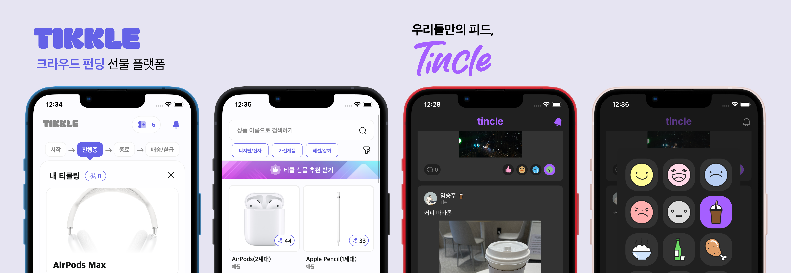
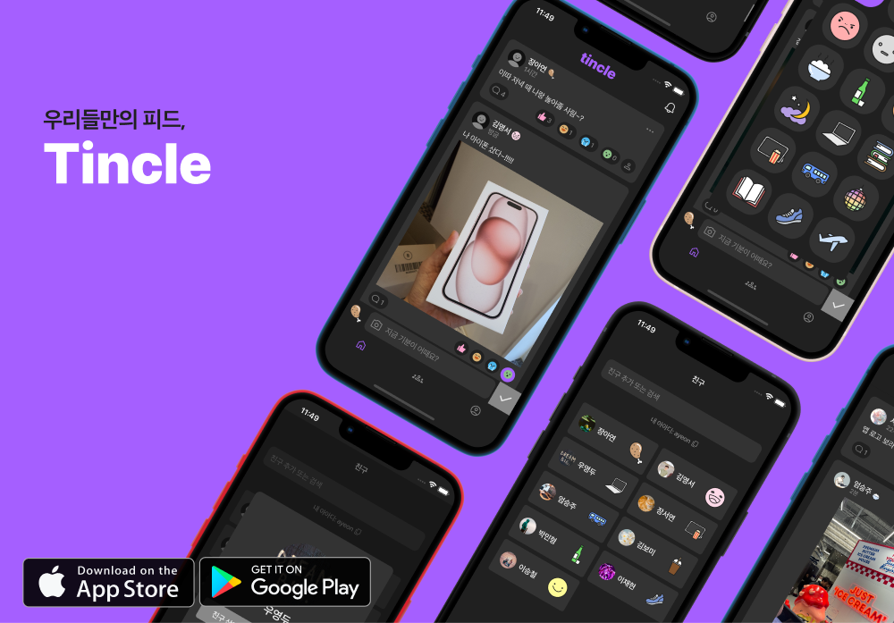

<h1 align="center">Hi 👋, I'm Eum SeungJu</h1>

  

# 💻 App, Fe Developer

- Hi, I'm Seungju Eum, a **steady, upwardly mobile developer** who strives for perfection.
- Even with simple code, I worry about maintainability and readability.
- I develop quickly and pragmatically with agile, and improve it until it's perfect.
- I develop around data and feedback, centered around a better user experience.
- We challenge and strive in all areas, not just development.

## 📞 Contact & Channels

- **Email** | sjsjmine129@gmail.com, sjsjmine1@naver.com
- **Github** | [sjsjmine129](https://github.com/sjsjmine129)
- **PDF Portfolio** | [SeungJu_Portfolio](https://drive.google.com/file/d/1qin9mL0yP85Hh3atFpkLZ8dPI811yLEH/view?usp=drive_link)
- **Notion Portfolio** | [SeungJu_Notion](https://eumseungju.notion.site/Eum-SeungJu-51ffd9329341468aaba64686126faee3?pvs=4)
- **Resume** | [SeungJu_Resume](https://drive.google.com/file/d/11Ycp4Cg2mygZFIHFUT3nGMXucY0rgHli/view?usp=drive_link)
- **LinkedIn** | [승주-엄-2484b3288](https://www.linkedin.com/in/%EC%8A%B9%EC%A3%BC-%EC%97%84-2484b3288/)
- **Insta Profile** | [seungjuum](https://www.instagram.com/seungjuum/)
- **Insta Book** | [bookshelf_sj](https://www.instagram.com/bookshelf_sj/)

# 🛠 Stacks

Language

  
  
   
  
   

App / Front-End

 
  
   
  
   
  
  

Back-End

  
  

DevOps

   
  

Other Tools

   
   
   
  

# 🎈  Projects

  

  

