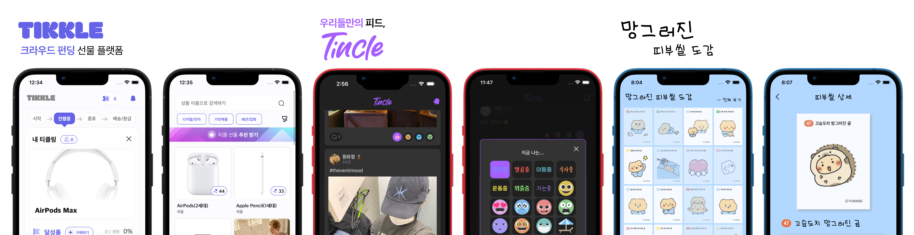
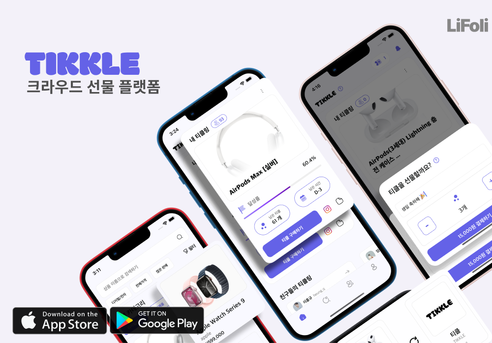
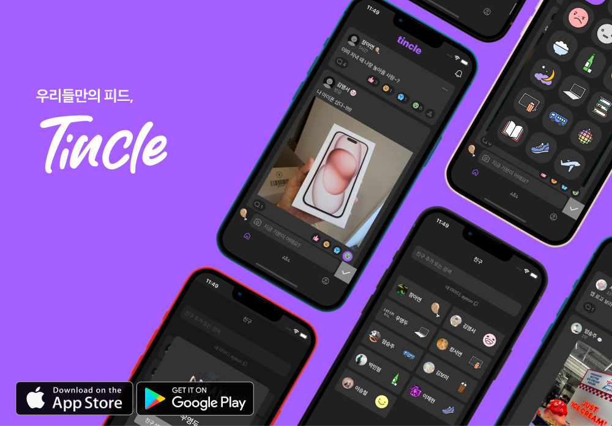

<h1 align="center">Hi 👋, I'm App Developer Eum SeungJu</h1>

# 📱 iOS, RN Developer

- Hi, I'm Seung Joo Um, a developer who quickly **absorbs and applies**.
- I can develop deployable apps with React Native and Swift.
- I can design UI directly with Figma and move it to code and implement it.
- As a full-stack app developer for 6 months, I have a good understanding of BE. So, I can communicate well with other developers.
- I've also experienced planning, marketing, and designing services, so I have a broader perspective of app develop.

## 📞 Contact & Channels

- **Email** | sjsjmine129@gmail.com, sjsjmine1@naver.com
- **Github** | [sjsjmine129](https://github.com/sjsjmine129)
- **Portfolio** | [SeungJu_Notion](https://eumseungju.notion.site/Eum-SeungJu-51ffd9329341468aaba64686126faee3?pvs=4)
- **Insta Profile** | [seungjuum](https://www.instagram.com/seungjuum/)
- **Insta Book** | [bookshelf_sj](https://www.instagram.com/bookshelf_sj/)

# 🛠 Stacks

  
    <label>Language</label>
    

      
      
       
    

  

<label>App / Front-End</label>

 
  
   
  
   

<label>Back-End</label>

  
  

<ladel>DevOps</label>

   
  

</ladel>

<label>Other Tools</label>

   
   
  

# 🎈  Projects

  

  
 
  
